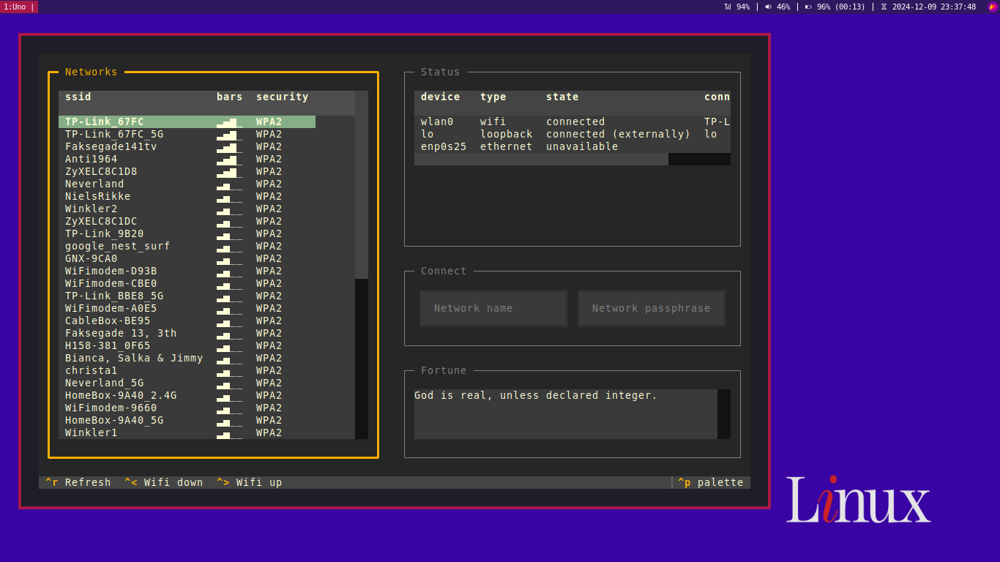
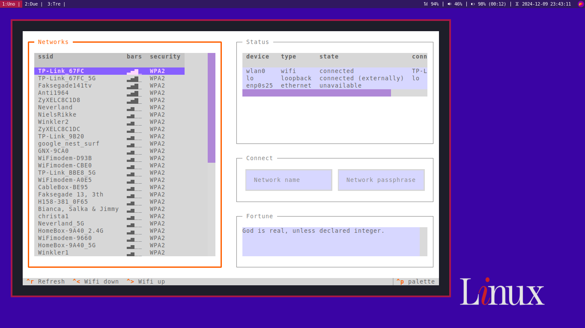
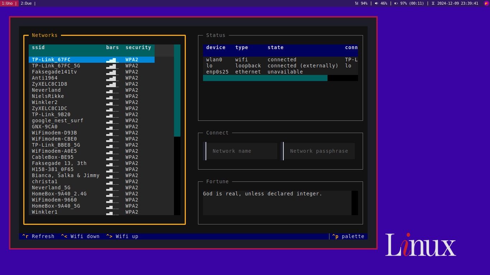

# tui-network

`tui-network` is a Python based TUI for managing the wifi on Linux built with [Textual](https://github.com/Textualize/textual). And you can read [classic fortune quotes](https://wiki.debian.org/fortune) on the side, while waiting for the list of networks to refresh.

## Rationale

I've recently started using [i3wm](https://i3wm.org/) on a DE-less Debian install as my main driver and I'm trying to keep it as minimal as possible, getting the most out of the terminal. While I like the simplicity and effectiveness of [nmtui](https://man.archlinux.org/man/nmtui.1), I find it really ugly. After some digging, I finally found the awesome [Impala](https://github.com/pythops/impala), which inspired me to make my own in Python with Textual.

## Themes

You can change the theme by hitting `ctrl+p`. A sneak peek at some of them:






## Usage

### Connect to a network
- `enter` on a network to compile the Network Name input field
- insert the passphrase
- `enter` to connect

### Scan for available networks
- `ctrl+r` to rescan and refresh the page

### Toggle the wifi power
- `ctrl+1` to power up the wifi
- `ctrl+2` to power down the wifi
- `ctrl+r` to rescan and refresh the page

## Dependencies

You need to have `nmcli` installed.

## Install

```
git clone https://github.com/Zatfer17/tui-network
cd tui-network
pipx install .
```

## Feature matrix

- [x] Display current wifi network name
- [x] Show current wifi network signal
- [x] Display available networks
- [x] Show available networks signal
- [x] Connect to available networks
- [x] Pretty interface
- [x] Refresh shortcut
