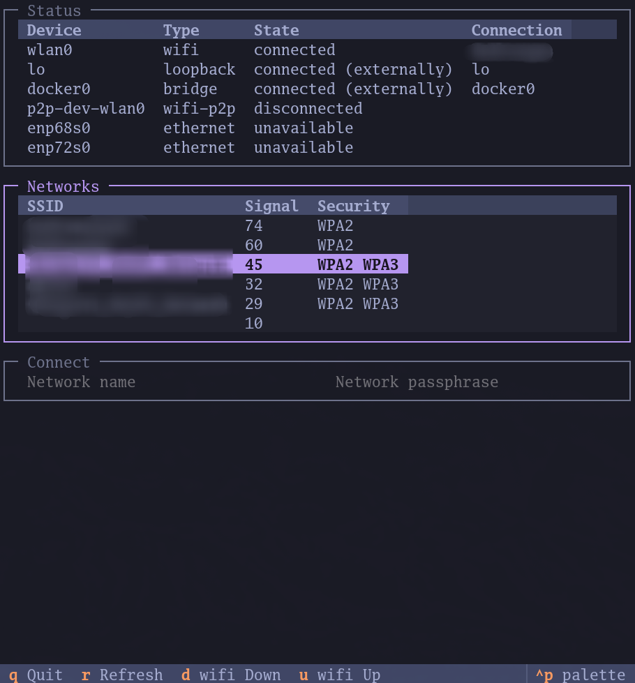

# tui-network

This is an experimental fork of [Zatfer17's
tui-network](https://github.com/Zatfer17/tui-network).
It aims for minimalism and to fit well in [Omarchy](https://omarchy.org).

It uses NetworkManager as the backend - currently through `nmcli`.
While not as pretty as [Impala](https://github.com/pythops/impala),
it also tries for a smoother learning curve.

## Themes

Integrating with Omarchy theming system is TODO.
Currently you can change the theme by hitting `ctrl+p`.


## Usage

[Tab], arrow keys, [Enter], plus shortcuts displayed in the footer.
Alternatively, also works with mouse.

## Dependencies

You need to have `nmcli` installed.

## Install (with [uv](https://docs.astral.sh/uv/getting-started/installation/))

```
git clone https://github.com/krymzonn/tui-network
cd tui-network
uv tool install .
```

## Features

- [x] Display available networks
- [x] Show available networks signal
- [x] Connect to available networks
- [x] Refresh shortcut

